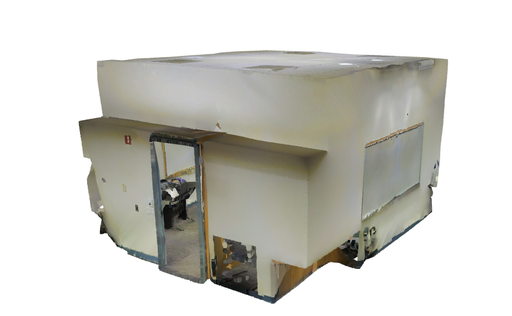
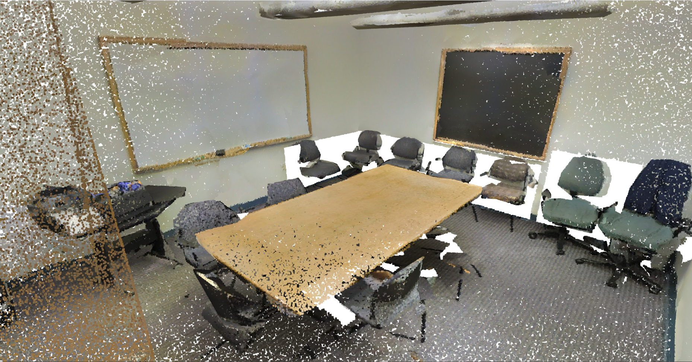
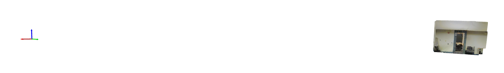
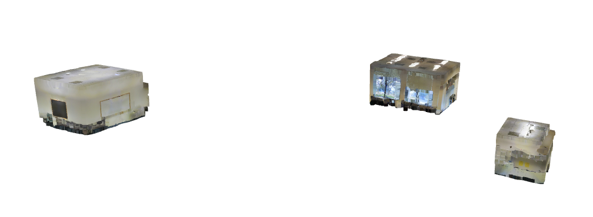
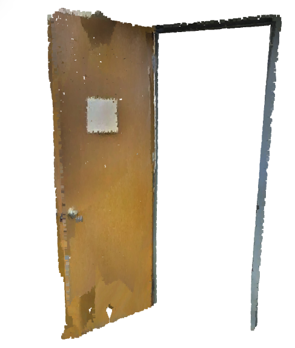
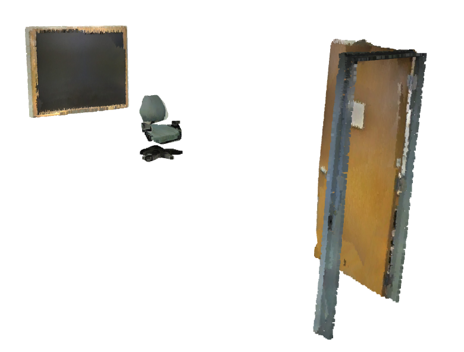
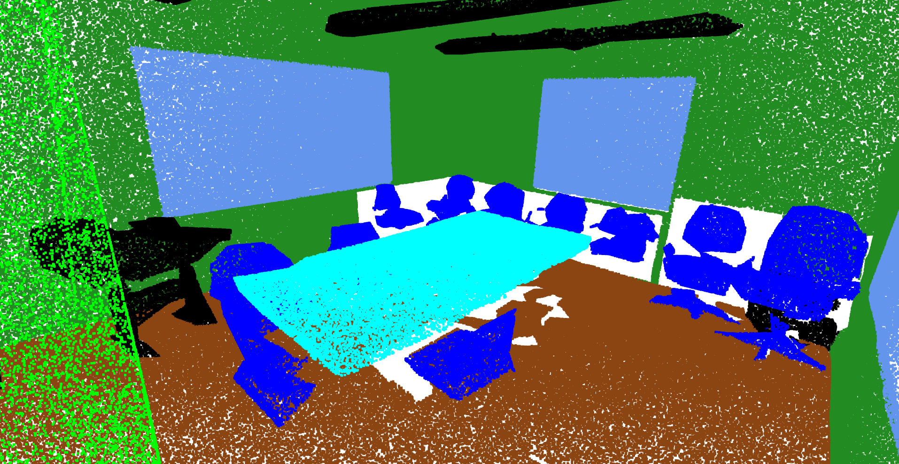
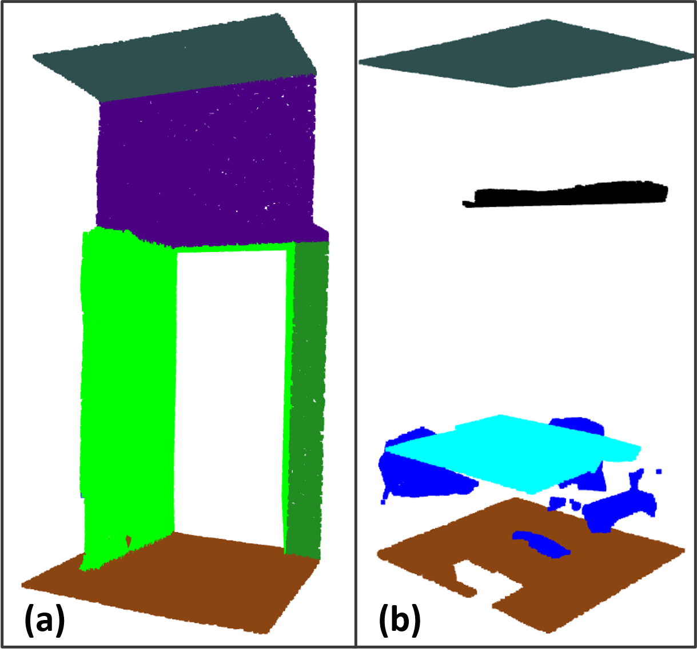

# Stanford 3D Scene Understanding Dataset (S3DIS)

Written by [Moien Rangzan](https://github.com/moienr)

Based on the work of [Issac Berrios](https://github.com/itberrios) and his amazing [Medium Article](https://towardsdatascience.com/point-net-for-semantic-segmentation-3eea48715a62)

## Introduction

This notebook explores the [3DIS](https://docs.google.com/forms/d/e/1FAIpQLScDimvNMCGhy_rmBA2gHfDu3naktRm6A8BPwAWWDv-Uhm6Shw/viewform?c=0&w=1) dataset. The used version is `Stanford3dDataset_v1.2_Aligned_Version`. "There are two versions of this data set, the raw and aligned, we choose to use the aligned version. The aligned version is the same as the raw except each point cloud is rotated such that the x-axis is aligned along the entrance of the room, the y-axis is perpendicular to the entrance wall, and the z-axis remains the vertical axis." [1]


The images are derived in this [Notebook](./s3dis_visualizer.ipynb)

## Data Structure

The S3DIS dataset is divided into 6 areas. Each area is divided into Spaces(rooms, halls, etc.). Each Space has its own point cloud file. Each point cloud file is stored in a `.txt` file as `(3,N)` array. Each point is stored in the following format: `X Y Z R G B`. The `XYZ` is the position of the point in the 3D Space. The `RGB` is the color of the point. Each color value is stored in a range from 0 to 255. Also, each Space has its own annotation folder. The annotation folder contains the `.txt` files with the same format as the main file, each representing an object in the Space. refer to the [Anotaion Folder](#anotaion-folder) section for more details. 

**Example of the `.txt` file:**

```text
-15.609 39.505 2.214 71 64 54
-15.634 39.518 2.198 68 64 52
-15.622 39.514 2.195 70 61 52
-15.621 39.510 2.215 72 65 55
-15.606 39.505 2.211 71 63 52
...
```


**Sample: Conference Room 1 in Area_1 from Outside**



**Sample: Conference Room 1 in Area_1 Inside**



## Problem: Off-Axis

In the S3DIS dataset the axis does not start from 0,0,0. And I believe that each `Area` has its own axis, and all Space areas are in reference to that axis, in such way that if we connect all Space together, we will get the whole area. Nontheless, this is a problem as we need normalized values between 0 and 1 for training a deep learning model. (This is done in the notebook [here](../s3dis_raw_explorer.ipynb) by subtracting the min value of each axis from all the values in that axis, and then dividing by the max value of that axis.)

**Location of the conference room in reference to the 0,0,0 axis**


**Conference Room 1, Conference Room 2, and Copy Room loaded together**



## Anotaion Folder
The data of annotation is stored in the `Annotations` folder. Each area has its own folder. In that folder, are all the objects that are in that area. Each object is stored in a `.txt` file, with the same `XYZ RGB` format as the main point cloud. 

**Sample: Conference Room Door**




Same as the area, can be restored by adding all the Space together. If we add all the objects together, we will get the whole Space.

**Sample: Conference Room Door, Chair, and Board**




## Segmentation Mask
As coded in [this Notebook](../s3dis_raw_explorer.ipynb), they remove the `RGB` from the point cloud, and replace it with annotation categories.

| Category | Code | Color | RGB |
|:--------:|:----:|:-----:|:---:|
| ceiling  | 0    | darkslategray | (47, 79, 79) |
| floor    | 1    | saddlebrown | (139, 69, 19) |
| wall     | 2    | forestgreen | (34, 139, 34) |
| beam     | 3    | indigo | (75, 0, 130) |
| column   | 4    | red | (255, 0, 0) |
| window   | 5    | yellow | (255, 255, 0) |
| door     | 6    | lime | (0, 255, 0) |
| table    | 7    | aqua | (0, 255, 255) |
| chair    | 8    | blue | (0, 0, 255) |
| sofa     | 9    | fuchsia | (255, 0, 255) |
| bookcase | 10   | palegoldenrod | (238, 232, 170) |
| board    | 11   | cornflower | (100, 149, 237) |
| stairs   | 12   | hotpink | (255, 105, 180) |
| clutter  | 13   | black | (0, 0, 0) |

**Sample: Conference Room Inside with Segmentation Mask**



## Partitioning the Data
The main idea behind partitioning the data, deployed by [Issac Berrios](https://github.com/itberrios) is as follows:

* Each Space is divided into approximately 1m x 1m (parameter `c=1.5`) blocks (all of the z axis is included).
    - In the code first, the min and max of the x and y axis are calculated.
    - Then the rounded number of blocks (int) in each axis is calculated, using a hyperparameter `c` which is the size of the block in meters. (since it is rounded, the actual size of the block might be exactly `c`.)
    - using the `np.histogram` the boundaries of the blocks are calculated.
    - And the data is partitioned using the `get_slice` function.





Now if we concatenate all the partitions of the same Space, we will get **exactly** the same Space.


## References
[1] [Point Net for Semantic Segmentation](https://towardsdatascience.com/point-net-for-semantic-segmentation-3eea48715a62)
